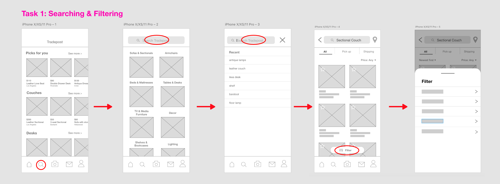
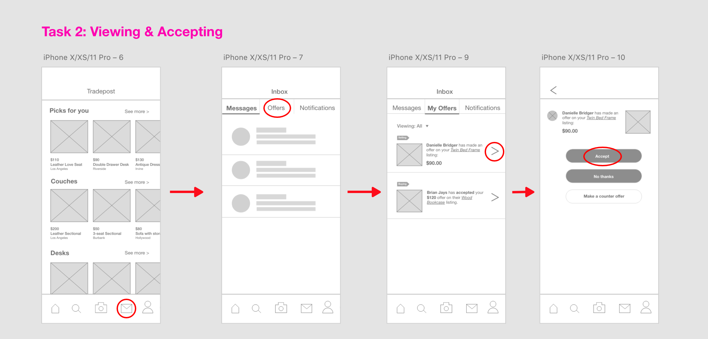
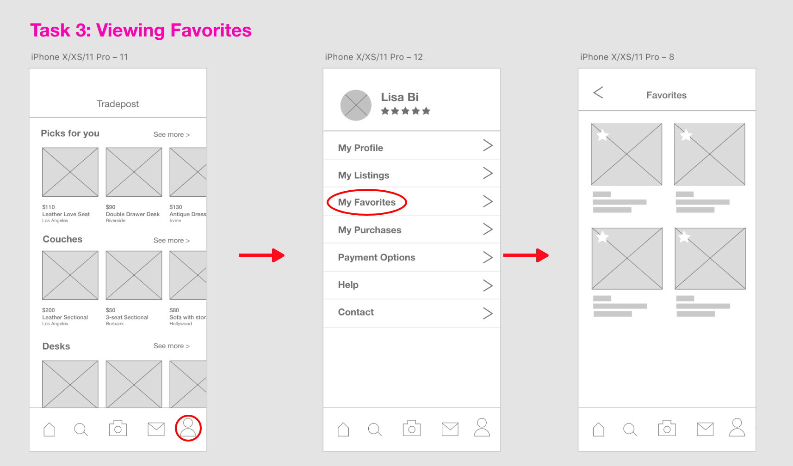
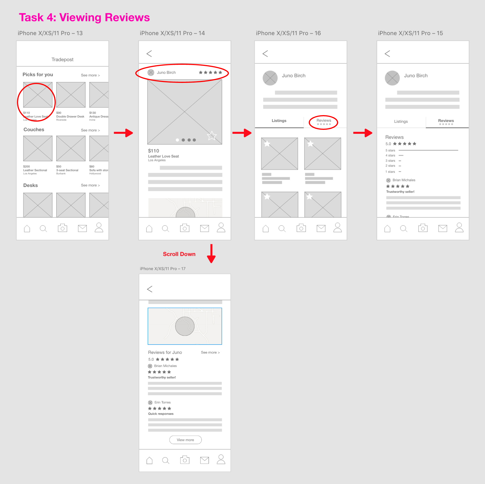

## Tradepost
Lisa Bi 

DH 150

## Introduction: a brief information about the project. 

(What is the project about? The motivation of the project and possible contribution.)

Tradepost is an app that aims to provide a quick and easy way for users to buy and sell their furniture. This project seeks to provide a user-to-user resale app for furniture. The goal of the current project is to create a specialized market for furniture. With this in mind, the app was designed with the goals, motivations, needs, and pain points of furniture buyers in mind. With this particular application, the main audience I will be designing for is middle age women.

## Clear design statement: 

(What is the issue and Why do you think it is important to resolve that issue by your project?)

Currently, users who attempt to buy second hand furniture online face several issues. First, it is difficult to trust sellers. Resale markets tend to be rife with scammers, which is particularly troubling when attempting to purchase big-ticket items such as furniture. Second, it can be difficult to search for the specific item that you want. Although some resale markets have filtering options, since these markets are not specialized for furniture, the filtering options are not useful and are too generalized. On the seller end, lack of interaction from users can be discouraging, which leads to low retention rates. Moreover, posting listings can be time-consuming and annoying. When selling furniture, transportation tends to be a point of particular frustration. These factors can be points of frustration for buyers and sellers alike. 

With Tradepost, I seek to address these issues with a specialized furniture app. I have designed a review system so that users can easily evaluate the trustworthiness of sellers and gain a sense of assurance. When searching for items, users can filter by the type of item, the material, the color, the price, the condition, the distance, the more, so that users can view items that fit their specific preferences. Users can also favorite items. This feature functions in two capacities: it allows buyers to save items so that they can view them later, and it allows sellers to have a form of interaction with buyers, which is encouraging and can foster higher satisfaction and retention.

## Competitor analysis [assignment01 & 02]:
Summary and link to the heuristics and usability testing of the *existing* product(s) - or the *original* website you evaluated
Add image of competitors
Embed video

For the competitor analysis, I analyzed OfferUp, a resale market with an emphasis on in-person transactions, and Depop, a popular clothing resale market that implements features of social media applications. These two applications are opposite in terms of their execution. OfferUp is very utilitarian and plain, while Depop is bold and trendy. I wanted to study what aspects these applications got right, and what aspects they got wrong. 

## User research [contextual inquiry, assignment04]:
Summary and link to your assignment folder

## UX storytelling [persona+scenario, assignment05]
Summary and link to your assignment folder

## Wireframe and graphic design element variation [assignment06 + part of 07]

  
 | 

 | 
<table>
  
</table>

## Low-fidelity prototype (wireflow, assignment06)
Summary and link to the sketches (may contains the multiple versions and evaluation history)

## High-fidelity prototype (functional/interactive prototype, assignment08)
Summary statement and link to or an embedded prototype

## Optional evaluation and revision history 
Including cognitive walkthrough; impression test, accessibility audit, usability testing), per each summary and link to the notes (when you share the video or other detailed evidences, I will notify you when you can make the contents private as soon as your work is graded)

## Pitch video [update the video after recording your presentation]

## conclusion: what you learned throughout the process
